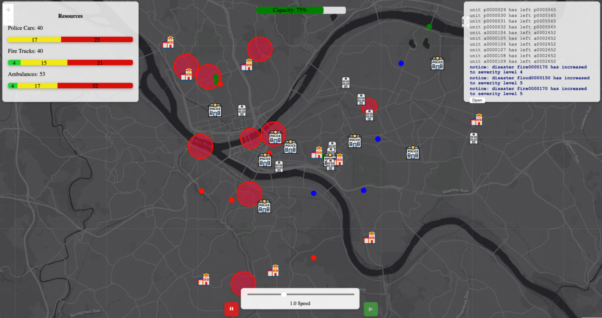
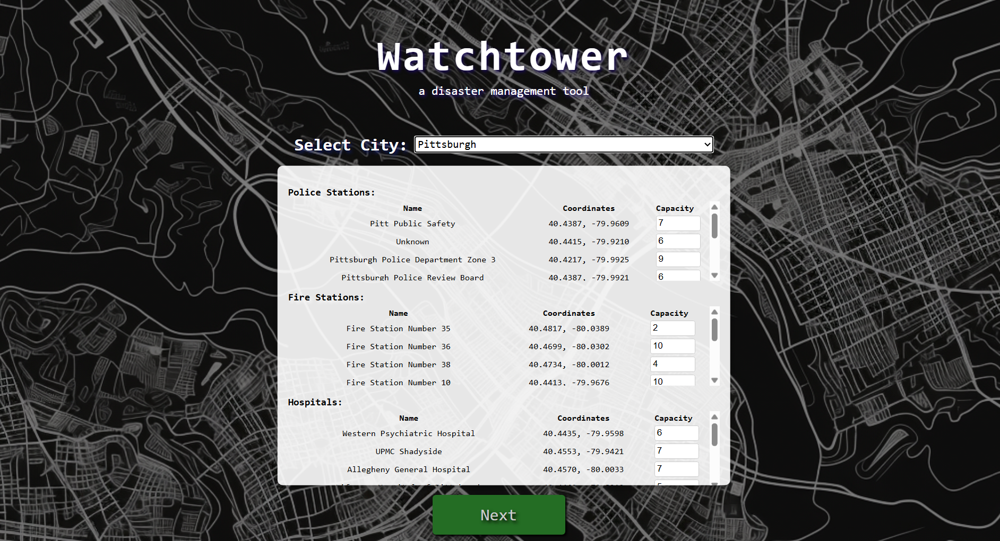
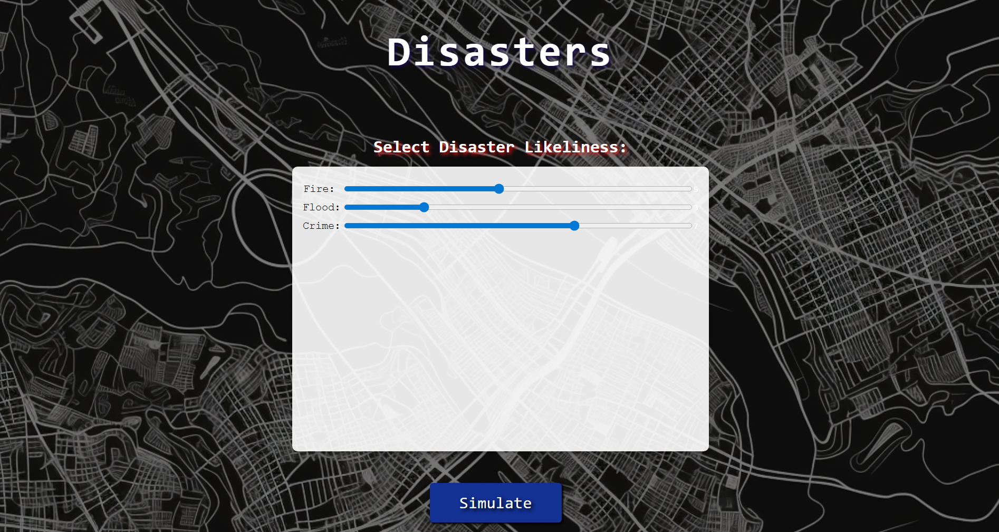

# Watchtower (SteelHacks XII)
## A "real time" disaster response simulator
### Made by Aidan McHugh, James Toscano, & Noah Knishkowy

## Description
An interactive web based platform that models disaster scenarios (fires, floods, crimes, etc) across various cities. Users are able to oversee and manage emergency units (police, fire, medical teams) in response to evolving crises, balancing speed, capacity, and resource constraints. This project highlights the power of real time simulation, data driven decision making, and interactive visualization to demonstrate how technology can aid in disaster response and urban resilience planning.

## Features
- Dynamic Disaster Generation (fires, floods, crimes spawn randomly or based on user input)
- Emergency Unit Management (Automated resource decision making)
- Tick-based Simulation Engine
- Interactive Map Interface
- Resource Constraints & Statistics

## Tech Stack
- React (JavaScript)
- Spring Boot (Java)
- Leaflet
- OpenStreetMap -> Overpass API

